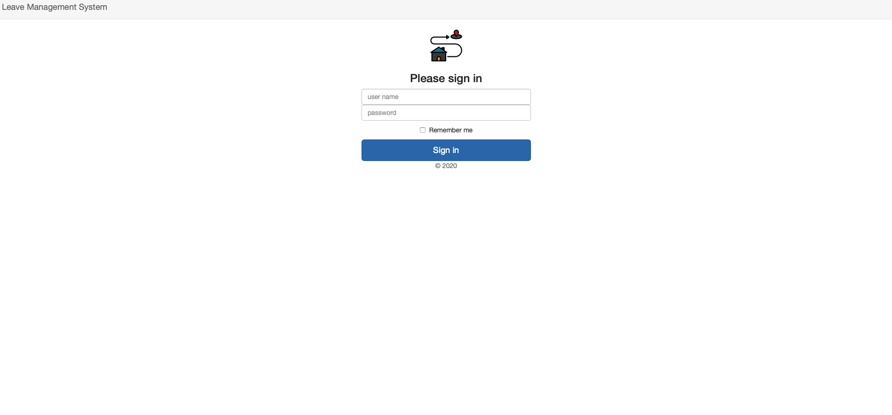
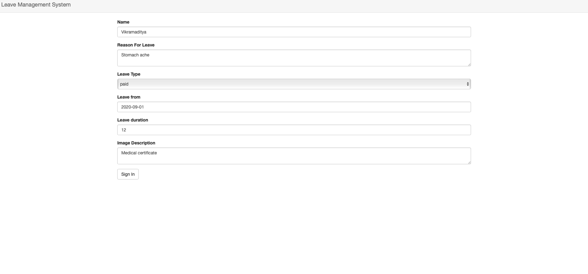
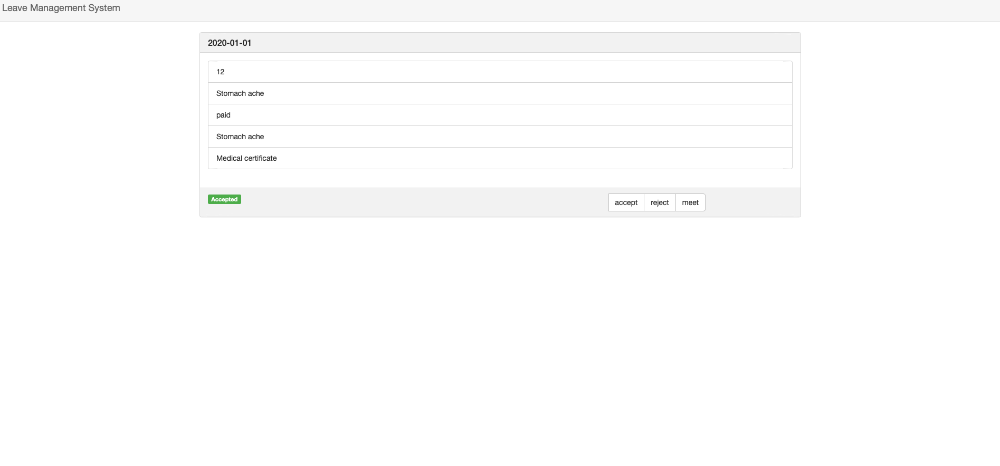

# Tech Stack

- Flask
- Jinja templates 
- Bootstrap 
- VueJs

The report is present in the `./doc` directory.
# Setup

To setup the environment 

- Setup a virtual environment using `virtualenv` and activate it.

- ~~Run the `python environment.py` file to setup the environment variables
 present in `.env` file or~~ run the `setup.sh` script to set the environment
  variable.
- Use `pip install requirement.txt` for installing the required libs.

# Running 

- To start the server use `flask run` command. (The server will runt in development mode)
- Visit `http://127.0.0.1:5000/` you will be greeted with a sign-in page.

# Basics

- The first page is the sign in page (the current availible credential are )



```reStructuredText
"name":"student"
"password":"student"

"name":"prof"
"password":"prof"
```

- You will be redirected to apply for leave page ( this behaviour is limited to development version the production version redirects to profile page )



- You can apply for new leave (By filling the form). 
- After that you will be redirected to logs (The previous and the current records are availible her along with there status).
- For the professor login the logs will give an extra option to either accept or decline a leave.




# Upcoming Enhancement

- Email verification
- Support for notifications and badges
- Image in profile page
- More types of leave


